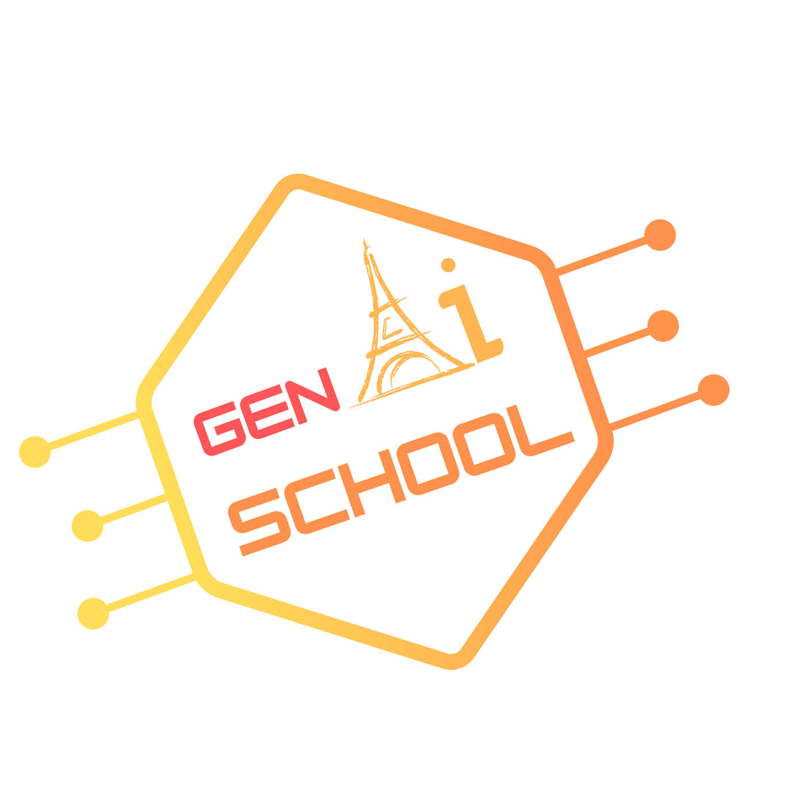

[**Description**](#description)
| [**Important Dates**](#important-dates)
| [**Speakers**](#speakers)

Grand Amphi  
PUIO, Building 640, Université Paris-Saclay  
91400 Orsay 
[https://maps.app.goo.gl/SfnGKoL126r63VJh6](https://maps.app.goo.gl/SfnGKoL126r63VJh6)

## Description

The GenAI-School aims to provide an overview of the latest advances in generative AI, covering theoretical foundations, methodologies, and practical industrial applications beyond NLP. The program will introduce fundamental methodological tools and presentations from experts across diverse scientific fields.

The basic methodological tools will be presented, and then speakers from different scientific fields will show the most recent applications and developments. The aim is to bring together various speakers to cover a broad range of fields of study and offer participants an overview of generative AI and its applications.
The school will also be an excellent opportunity to build your network, discuss your research (during poster sessions and flash talks), and learn about post-doctorate opportunities.

This event is co-organized by Université Paris-Saclay and Institut Polytechnique de Paris and co-financed by the DIM AI4IDF. 

Topics will include : 

* Foundations of generative models: VAE, GAN, and diffusion models,
* Large Language Models and advanced techniques (e.g., RAG),
* Multimodal generation,
* Frugal models,
* Ethics of generative AI,
* Applications of generative AI to :
   * Audio synthesis,
   * Climate change,
   * Image and video generation,
   * Medical data,
   * Meteorology,
   * Telecommunications and networking,
   * Robotics
   * ...

## Target audience
* Master/PhD students or researchers with a background in AI/ML interested in the latest advances in generative AI.
* Master/PhD students or researchers from other fields eager to explore the potential of generative AI for their work.

If you fit either description, this autumn school is for you!
    
## Important Dates
* First round application deadline: 16th of June 2024
* Notification to applicants: 30th of June 2024
* Second round application deadline: 16th of July 2024
* Notification to applicants: 30th of July 2024
* Master students notification: after the 15th of September 2024
* **School: 21-25 October 2024**

All deadlines are 23:59 AoE (UTC-12)

## Speakers 

### Keynote
* **[Xavier Alameda-Pineda](http://xavirema.eu/)** - Inria at University Grenoble Alpes, Grenoble, France
* **[Antoine Bosselut](https://atcbosselut.github.io/)** - EPFL
* **[Claire Boyer](https://www.imo.universite-paris-saclay.fr/~claire.boyer/)** - Sorbonne University
* **[Merouane Debbah](https://www.ku.ac.ae/college-people/merouane-debbah)** - Khalifa University
* **[Manuel Faysse](https://manuelfay.github.io/#)** - CentraleSupélec, Université Paris-Saclay/Illuin Technology
* **[Vicky Kalogeiton](https://vicky.kalogeiton.info/)** - LIX, IPP
* **[Eric Moulines](http://www.cmapx.polytechnique.fr/~moulines/)** - Ecole Polytechnique
* **[Claire Monteleoni](https://www.colorado.edu/faculty/claire-monteleoni/)** - University of Colorado Boulder/INRIA
* **[Alasdair Newson](https://sites.google.com/site/alasdairnewson/)** - Sorbonne Université
* **[Gaël Richard](https://www.telecom-paris.fr/gael-richard)** - IPP/Télécom Paris
* **[Yunhao (Robin) Tang](https://robintyh1.github.io/)** - Meta GenAI London
* **[Denis Trystam](https://datamove.imag.fr/denis.trystram/)** - Grenoble INP

### Lab session 
* **[Manuel Faysse](https://manuelfay.github.io/#)** - CentraleSupélec, Université Paris-Saclay/Illuin Technology
* **[Badr Moufad](https://github.com/Badr-MOUFAD)** - LIX, IPP
* **[Yazid Janati](https://yazidjanati.github.io/)** - LIX, IPP
* **[Yunhao (Robin) Tang](https://robintyh1.github.io/)** - Meta GenAI London
* **Xi Wang** - LIX, IPP

More information about the speakers [here](./speakers).

