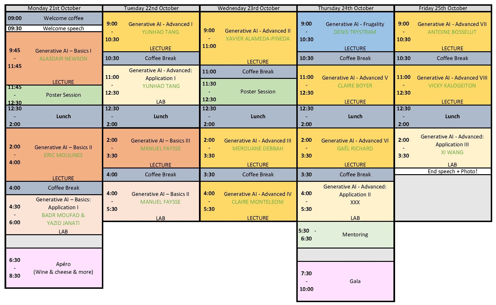

# Lectures & Lab

## Monday the 21st of October

* 9:45 AM - 11:45 AM: **Introduction to Deep Generative Models** 
_Alasdair Newson_ 
Deep generative models are neural networks which produce random examples of complex data. In this session, we will review the bascis of the three currently most popular models : the Variational Autoencoder (VAE), the Generative Adversarial Network (GAN), and the Diffusion Model. We investigate them from the point of view of image synthesis, which is one of their most common, and high-profile, applications. We will first introduce the notion of a latent space, which is central to the first two of these models. We will then explore each model, introducing the mathematical and statistical tools required to understand them. We will compare their advantages and limitations, as well as the quality of their visual results. 

* 2:00 PM - 4:00 PM: **Score based denoising diffusion: An introduction** 
_Eric Moulines_  
**Diffusion models** have recently gained considerable momentum in the field of generative modeling, owing to their ability to generate highly realistic samples from complex, high-dimensional distributions. Their versatility has opened up new horizons not only in the realm of data synthesis but also in tackling challenging **Bayesian inverse problems**, where the objective is to infer unknown parameters from indirect or noisy observations. By leveraging pre-trained diffusion models as flexible priors, researchers can solve these inverse problems in a way that is both efficient and computationally tractable, without the need for retraining.
This survey aims to provide a **comprehensive review** of cutting-edge methodologies that exploit pre-trained diffusion models for solving Bayesian inverse problems, focusing on approaches that avoid additional training. Specifically, we examine how these models can be adapted to approximate posterior distributions, offering a detailed analysis of techniques based on modifying or '**twisting**' the intermediate distributions in the diffusion process. This modification is done to steer the generative process toward the desired posterior, enabling more accurate sampling and inference.
To formalize this approach, we introduce a **sequential Monte Carlo (SMC) framework** tailored for sampling from these twisted distributions. This framework provides a systematic way to incorporate observations and posterior constraints into the generative process, enhancing the accuracy of the inferred solutions. We discuss several methods for efficiently approximating this sampling process, including importance sampling, resampling strategies, and variational techniques that minimize computational overhead while maintaining robustness.
Additionally, we provide a **detailed analysis of the theoretical foundations** underlying these methods, highlighting the connections between recently proposed approaches in the literature. This includes a discussion of **convergence properties**, practical implementation challenges, and trade-offs in terms of computational complexity and approximation accuracy. By doing so, we offer deeper insights into how these techniques can be effectively implemented in a variety of applications, from medical imaging to geophysical exploration, where Bayesian inverse problems are prevalent.

* 4:30 PM - 6:00 PM: **Unveiling the Mechanisms Behind Diffusion Models with Applications to Image Restoration**  
_Badr Moufad et Yazid Janati_ 
Diffusion Models (DMs) have impressively pervaded the field of generative modeling. They rapidly gained prominence thanks to their remarkable ability to model complex and multi-modal patterns. More importantly, the potential of DMs go beyond mere data generation. For instance, they are viable zero-shorts learner that can be used to solve downstream tasks without further training.
This practical session will be split into two parts. In the first, we will demystify the foundational aspects of DMs. Using a simple example of 2D points, we will understand key components of a DMs, their interplay, and practical implementation. In the second part, we will explore one among the interesting applications of DMs: solving Bayesian inverse problems. We will look at how we can leverage DMs to solve challenging image restoration problems, such image colorization, Super Resolution, without additional training.  
Outline.
    * Training score-based diffusion model from first principles
      * Dataset, architecture, training objective: what you need to know
      * Sampling schemes: generating new data samples
      * Extension to conditional diffusion models
    * Zero-shot learning with diffusion models priors
      * Preliminary: Bayesian inverse problems
      * Diffusion model posterior samplers
      * Image restoration via diffusion models priors

## Tuesday the 22nd of October

* 9:00 AM - 10:30 AM: **Reinforcement from human feedback: Some theory and practice**,  
_Yunhao Tang_ 
Reinforcement learning from human feedback (RLHF) is a major paradigm for the alignment of large language models. In this session, we will go through the basics of RLHF: the basic setup and background on RL, reward and preference models, the online and offline approaches to RLHF, their extensions and limitations. The theoretical discussion will be complemented by a practical session that hinges on the fundamentals.

* 11:00 AM - 12:30 AM: **Reinforcement from human feedback: Some theory and practice**,  
_Yunhao Tang_ 
Reinforcement learning from human feedback (RLHF) is a major paradigm for the alignment of large language models. In this session, we will go through the basics of RLHF: the basic setup and background on RL, reward and preference models, the online and offline approaches to RLHF, their extensions and limitations. The theoretical discussion will be complemented by a practical session that hinges on the fundamentals.

* 2:00 PM - 3:30 PM: **How to train a LLM in 2024**,  
_Manuel Faysse_ 
In this talk, we will explore large language model pretraining through the concrete example of CroissantLLM, a small bilingual english-french language model released at the beginning of the year.  
This will enable us to dive into various topics such as model architectures, scaling laws, data collection, tokenization, instruction-tuning... 
In a constantly evolving field, we will finally reflect upon where future developments are heading. 

* 4:00 PM - 5:30 PM: **How to train a LLM in 2024**,  
_Manuel Faysse_ 
In this talk, we will explore large language model pretraining through the concrete example of CroissantLLM, a small bilingual english-french language model released at the beginning of the year.  
This will enable us to dive into various topics such as model architectures, scaling laws, data collection, tokenization, instruction-tuning... 
In a constantly evolving field, we will finally reflect upon where future developments are heading. 

## Wednesday the 23rd of October

* 9:00 AM - 11:00 AM: **Probabilistic generative models for audio-visual processing**,  
_Xavier Alameda-Pineda_ 
In this talk, we will start with an overly-used old-timer: the expected-complete data log-likelihood. We will demonstrate the interest of this object for learning with latent variables, and showcase it with a few basic probabilistic models. We will move on to discuss more complex shallow models for audio-visual fusion, and quickly move on to neural models to process auditory and visual data, either in sequences or frame-wise. We will end up demonstrating the interest of this framework with more recent generative models. Applications will range from tracking, to speech enhancement, as well as motion prediction.

* 2:00 PM - 3:30 PM: **Large Language Models: The Falcon case study**,  
  _Merouane Debbah_ 
Reinforcement learning from human feedback (RLHF) is a major paradigm for the alignment of large language models. In this session, we will go through the basics of RLHF: the basic setup and background on RL, reward and preference models, the online and offline approaches to RLHF, their extensions and limitations. The theoretical discussion will be complemented by a practical session that hinges on the fundamentals.

* 4:00 PM - 5:30 PM: **Confronting Climate Change with Generative and Self-supervised Machine Learning**,  
_Claire Monteleoni_ 
The stunning recent advances in AI chatbots rely on cutting-edge generative deep learning algorithms and architectures trained on massive amounts of text data. Generative deep learning has also shown remarkable results when trained on video data and on combinations of different data types (i.e., multi-modal). The recent advances in generative deep learning can also benefit a variety of applications for addressing climate change. For example, generative deep learning trained on climate and weather data can be a powerful tool in generating an ensemble of weather predictions and in quantifying the uncertainty of long-term projections of climate change. 
As opposed to text and video, the relevant training data for this domain includes weather and climate data from observations, reanalyses, and even physical simulations. As in many massive data applications, creating “labeled data” for supervised machine learning is often costly, time-consuming, or even impossible. Fortuitously, in very large-scale data domains, “self-supervised” machine learning methods are now actually outperforming supervised learning methods. In this lecture, I will survey our lab’s work on developing generative and self-supervised machine learning approaches for applications addressing climate change, including detection and prediction of extreme weather events, and downscaling and temporal interpolation of spatiotemporal data. Our methods address problems such as forecasting the path and intensity of tropical cyclones, renewable energy planning, and projecting future sea-level rise.

## Thursday the 24th of October

* 9:00 AM - 10:30 AM: **Environmental and Societal impacts of (generative) AI**,  
_Denis Trystram_ 
In this talk, we will start with an overly-used old-timer: the expected-complete data log-likelihood. We will demonstrate the interest of this object for learning with latent variables, and showcase it with a few basic probabilistic models. We will move on to discuss more complex shallow models for audio-visual fusion, and quickly move on to neural models to process auditory and visual data, either in sequences or frame-wise. We will end up demonstrating the interest of this framework with more recent generative models. Applications will range from tracking, to speech enhancement, as well as motion prediction.

* 2:00 PM - 3:30 PM: **A primer on physics-informed learning**,  
 _Claire Boyer_ 
Physics-informed machine learning combines the expressiveness of data-based approaches with the interpretability of physical models. In this context, we consider a general regression problem where the empirical risk is regularized by a partial differential equation that quantifies the physical inconsistency. Practitioners often resort to physics-informed neural networks (PINNs) to solve this kind of problem. After discussing some strengths and limitations of PINNs, we prove that for linear differential priors, the problem can be formulated directly as a kernel regression task, giving a rigorous framework to analyze physics-informed ML. In particular, the physical prior can help in boosting the estimator convergence. We also propose the PIKL algorithm (PIKL for physics-informed kernel learning) as a numerical strategy to implement this kernel method.

* 4:00 PM - 5:30 PM: **Audio Generative AI**,  
_Gael Richard_ 
In this talk, we will present the recent progresses in audio generative AI. After a short introduction recalling the specificities of an audio signal, we will introduce some of the most important architectures of deep neural audio synthesis models. We will also briefly discuss some of the existing strategies for cross-modal audio generation and illustrate the potential of model-based (or hybrid) deep learning  for audio generative AI.

* 4:00 PM - 5:30 PM: **TBA**,  
_TBA_ 
TBA

## Friday the 25th of October

* 9:00 AM - 10:30 AM: **TBA**,  
_Antoine Bosselut_ 
TBA

* 11:00 AM - 12:30 AM: **Story-level multimodal generative AI: from understanding to generating visual data using multiple modalities**,  
 _Vicky Kalogeiton_ 
In this talk, I will address the importance of multimodality (i.e. using more than one modality, such as video, audio, text) for story-level recognition and generation. First, I will briefly introduce story-level multimodal video understanding, as audio, text, and visual temporal structure come naturally with the videos, and we can exploit them for free (FunnyNet-W and Short Film Dataset). Then, I will present how to guide the visual content generation from text and other modalities (classifier-free guidance, DynamicGuidance, ET).

* 2:00 PM - 3:30 PM: **TBA**,  
_Xi Wang_ 
TBA
